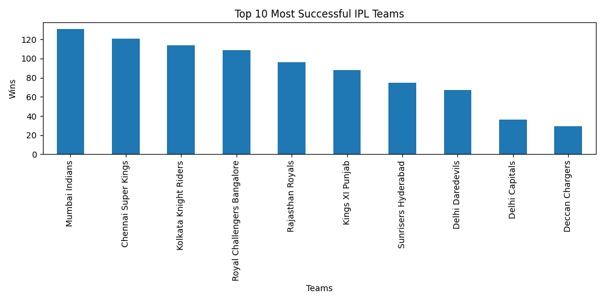
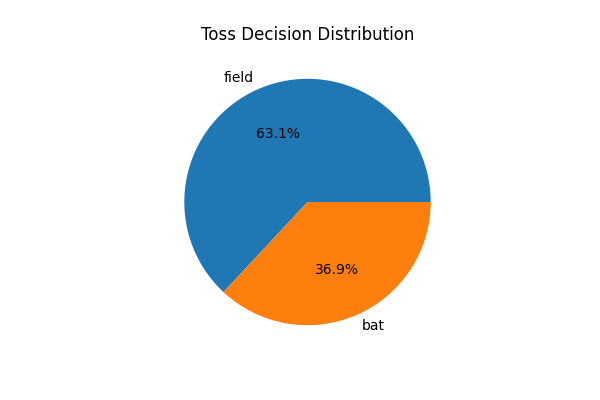
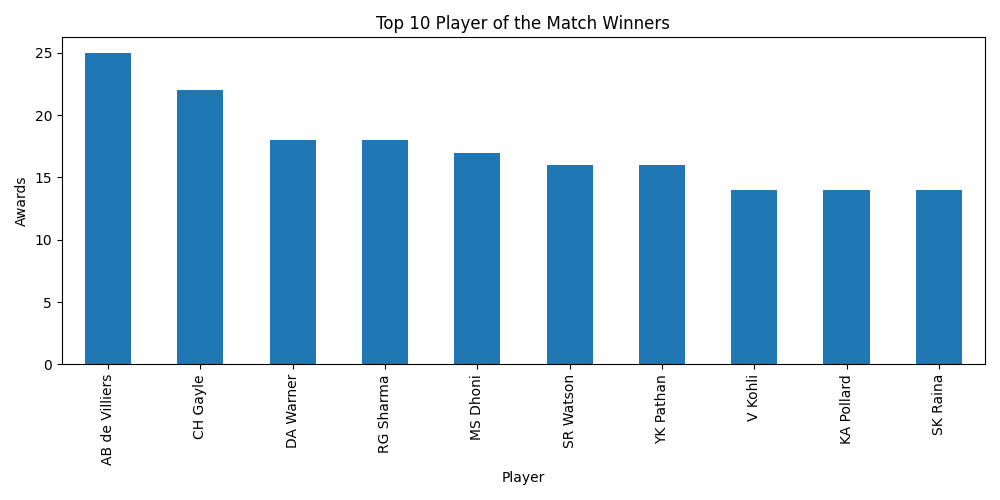
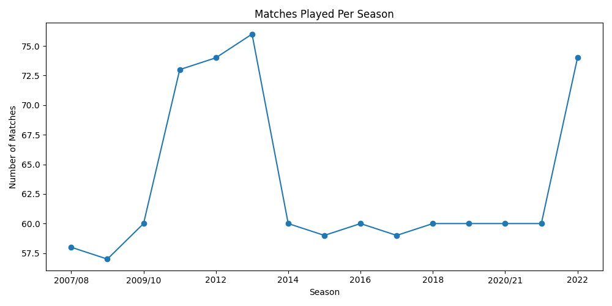
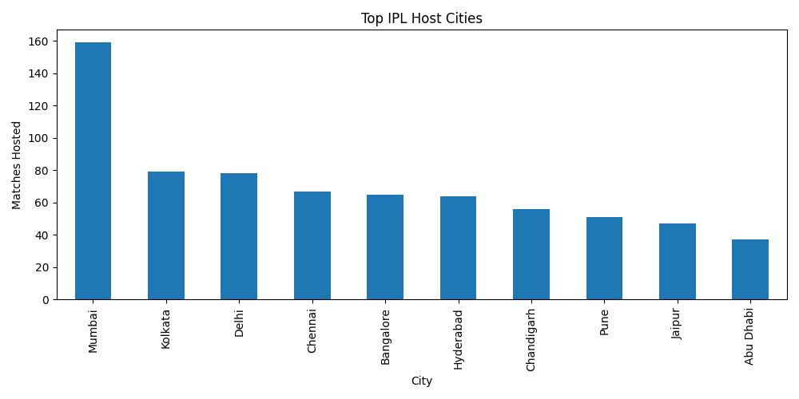

IPL Analysis

Project Overview

This project performs Exploratory Data Analysis (EDA) on Indian Premier League (IPL) match data using Python.

Technologies Used

* Python
* Pandas
* NumPy
* Matplotlib
* Seaborn
* Jupyter Notebook

Dataset

The dataset contains IPL match information including:

* Teams
* Match dates
* Venues
* Toss results
* Winning teams
* Player of the Match awards

Analysis Performed

* Most successful teams
* Toss impact on match results
* Venue-wise analysis
* Player of the Match analysis
* Winning trends across seasons
* Team performance comparison

Skills Demonstrated

* Data Cleaning
* Data Manipulation
* Data Visualization
* Exploratory Data Analysis (EDA)
* Statistical Insights

## Sample Visualization

## Toss Decision Analysis

This visualization shows the distribution of toss decisions made by IPL teams.

## Top Player of the Match Winners

This visualization shows the players who have won the most Player of the Match awards.

---

## Matches Played Per Season

This line chart shows how the number of IPL matches has changed across seasons.

---

## Top IPL Host Cities

This visualization highlights the cities that have hosted the most IPL matches.

Author

Umesh yadav 
